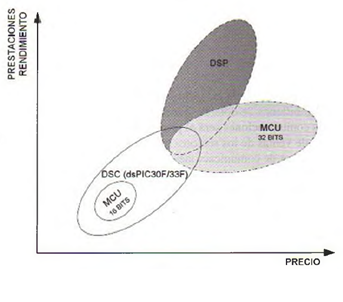
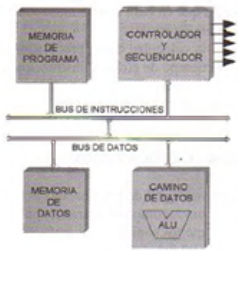
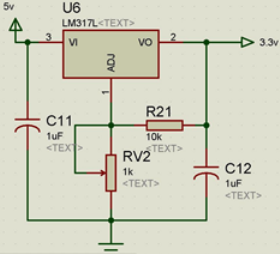

.. -*- coding: utf-8 -*-

.. _rcs_subversion:

Clase 01 - PIII 2015
====================

:Autor: César Osimani
:Correo: cosimani@ubp.edu.ar
:Fecha: 7 de agosto de 2015
:Regularidad: 
	- 2 prácticos parciales (que pueden ser avances del trabajo final)
  	- Individual o Grupos de 2 o 3 alumnos
:Final:
	- Entrega de un trabajo práctico integrador.
:Temas principales: 
  	- Arquitectura de los DSP (Digital Signal Processor)
	- Programación en C de los dsPIC30F y dsPIC33F
	- Utilización de software para la programación y simulación
	- Utilización de placa de desarrollo
	- Puertos de entrada, Conversor A/D, muestreo
	- Puertos de salida, Conversor D/A
	- Generador de señales, FFT, Filtros
:Ideas para trabajo práctico final:
	- Control a distancia por tonos DTMF  (Dual-Tone Multi-Frequency) 
	- Efectos para guitarra eléctrica
	- Distorsión de la voz en tiempo real para hablar sin ser reconocido
	- Distorsión de la voz como un juego. Ver Pou para Android. 
	- Poder insertar la voz en un archivo de audio WAV en otra portadora. Crear un dsPIC como codec.
	- dsPIC conectado a la PC por puerto serie USB
	- Afinador de instrumentos
	- Ecualizador y eliminador de ruidos
	- Desarrollo de placas de prueba

Introducción
============

- Brinda al estudiante herramientas de programación de microcontroladores para el procesamiento digital de señales.
- Conocimientos sobre programación de hardware específico para tratamiento de señales.
- Complementa lo desarrollado en "Teoría de Señales y Sistemas Lineales" y "Tratamiento Digital de Señales". 

Familias de microcontroladores Microchip
----------------------------------------

*MCU (MicroController Unit)*
	- Microcontroladores clásicos
	- Las operaciones complejas las realiza en varios ciclos
	
*DSP (Digital Signal Processor)*
	- Microcontroladores para procesamiento de señales
	- Las operaciones complejas las realiza en un sólo ciclo.

*DSC (Digital Signal Controller)*
	- Híbrido MCU/DSP
	- Controlador digital de señales
	

*dsPIC (Nombre que utiliza Microchip para referirse a sus DSC)*
	- PIC de 16 bits (registros de 16 bits)
	- Estudiaremos las familias dsPIC30F y dsPIC33F
	- Se pueden conseguir en Córdoba los siguientes: 
	#. dsPIC30F4013 (40 pines)
 	#. dsPIC30F2010 (28 pines)
	#. dsPIC33FJ32MC202 (28 pines)

Softwares
---------
- Proteus
- mikroC para dsPIC

*Proteus*
	- Conjunto de programas para diseño y simulación
	- Desarrollado por Labcenter Electronics (http://www.labcenter.com)
	- Versión actual: 8.3
	- Versión 8.1 para compartir. Algunos problemas con Windows 7
	- Versión 7.9 para compartir. Estable para XP, Windows 7 y Windows 8
	- Herramientas principales: ISIS y ARES

*ISIS (Intelligent Schematic Input System - Sistema de Enrutado de Esquemas Inteligente)*
	- Permite diseñar el circuito con los componentes.
	- Permite el uso de microcontroladores grabados con nuestro propio programa.
	- Contiene herramientas de medición, fuentes de alimentación y generadores de señales.
	- Puede simular en tiempo real mediante VSM (Virtual System Modeling -Sistema Virtual de Modelado).

*ARES (Advanced Routing and Editing Software - Software de Edición y Ruteo Avanzado)*
	- Permite ubicar los componentes y rutea automáticamente para obtener el PCB (Printed Circuit Board).
	- Permite ver una visualización 3D de la placa con sus componentes.

*mikroC para dsPIC*
	- Compilador C para dsPIC
	- Incluye bibliotecas de programación
	- Última versión 6.2 (febrero 2014)
	- Desarrollado por MikroElektronika ( http://www.mikroe.com/mikroc/dspic )
	- MikroElektronika también dispone de placas de desarrollo como la Easy dsPIC que disponemos en el Lab
	
	
Características principales de los DSP
--------------------------------------

- Arquitectura Harvard: Tiene memorias independientes para:
	- Memoria de programa
	- Memoria de datos: A su vez tiene dos espacios independientes para acceso en paralelo (X e Y).
	- Mejora la arquitectura de von Neumann: Programa y datos en la misma memoria

- Disponen de instrucciones que resuelven algoritmos para procesamiento de señales.
- Modos de direccionamiento sofisticados.
- Interrupciones con niveles de prioridad.

- La arquitectura Harvard posee buses independientes para instrucciones y datos.
	

ALU (Arithmetic Logic Unit): Realiza operaciones aritméticas

*Ejercicio 1*: Regulador de tensión para los dsPIC33F.
	- Alimentación desde un conector USB.
	- Utilizar herramientas de medición para asegurarse de los voltajes obtenidos.

*Ejercicio 2*: Alimentar el dsPIC33FJ32MC202.
	- Conectar el Master Clear
	- Utilizar capacitores de desacoplo
	- Conectar un cristal de cuarzo
	- Grabarle un programa simple (ver ejercicio 3)

*Ejercicio 3*: Crear un programa "Hola mundo" para el dsPIC33FJ32MC202.
	- Escribir una función void configuracionInicial() para configurar el puerto RB0 como salida
	- En la función main encender y apagar un LED en RB0 cada 1 segundo

*Ejercicio 4*: Programar en RB1 un segundo LED que encienda cada un determinado tiempo distinto al tiempo de RB0.
	- El LED en RB0 que encienda y apague cada 250 ms
	- El LED en RB1 que encienda y apague cada 133 ms

**Proteus (primer proyecto)**

- New Design
- Component mode (panel izquierdo)
- P (Pick Device) - permite seleccionar los componentes a utilizar en este proyecto
	- DSPIC33FJ32MC202
	- USBCONN
	- LM317L
	- A700 (es el prefijo de capacitores electrolíticos de alto valor)
	- CAP-ELEC - Capacitores electrolíticos generales
	- POT-HG - Potenciómetro
	- RES - Resistencia
	- LED-RED
	- CRYSTAL
- Terminals Mode - Permite agregar tierra, entrada, salida, etc.
	- GROUND

**Código ejemplo del Hola Mundo**

.. code-block::

	void main()  {
  	    TRISBbits.TRISB0 = 0;            
  	    LATBbits.LATB0 = 0;    

  	    while(1) {
    	        LATBbits.LATB0 = ~LATBbits.LATB0;       
    	        Delay_ms(1000);
  	    }
	}

**Regulador de tensión 3.3v (esto para los dsPIC33F)**

