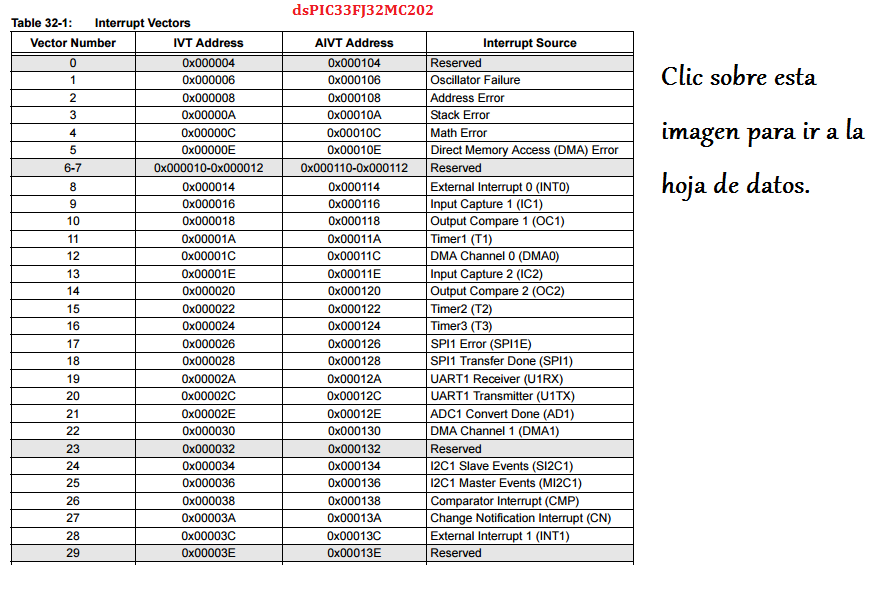

.. -*- coding: utf-8 -*-

.. _rcs_subversion:

Clase 02 - PIII 2016
====================

**Interrupciones**

- Eventos que hacen que el dsPIC deje de realizar lo que está haciendo y pase a ejecutar otra tarea.
- Las causas pueden ser diferentes (Interrupciones externas, Timers, ADC, UART, etc.).
- 7 niveles de prioridad (1 a 7 a través de los registros IPCx). Con 0 se desactiva la interrupción.
- Permite que una interrupción de mayor prioridad invalide una de menor prioridad que esté en progreso.
- Existe una tabla de vectores de interrupción (IVT) que indica dónde escribir la función que atenderá dicha interrución.
- También hay una tabla alternativa (AIVT) que se usa en situaciones de depuración o pruebas. 
- Cuando una interrupción es atendida, el PC (Program Counter) se carga con la dirección que indica la tabla de vector de interrupción (IVT)

.. figure:: images/clase02/ivt.png
   :target: http://ww1.microchip.com/downloads/en/DeviceDoc/70046E.pdf
   

  

**¿Cómo escribir una rutina del servicio de interrupción (ISR)?**

- Función void sin parámetros
- No puede ser invocada

.. code-block::

	void interrupcionExterna()  org 0x0014  {

	}

**Registros para configuración**
	
- IFS0<15:0>, IFS1<15:0>, IFS2<15:0>
	- Banderas de solicitud de interrupción. (el software debe borrarlo - hay que hacerlo sino sigue levantando la interrupción).

- IEC0<15:0>, IEC1<15:0>, IEC2<15:0>
	- Bits de control de habilitación de interrupción.

- IPC0<15:0>... IPC10<7:0>
	- Prioridades

- INTCON1<15:0>, INTCON2<15:0>
	- Control de interrupciones.
		- INTCON1 contiene el control y los indicadores de estado. 
		- INTCON2 controla la señal de petición de interrupción externa y el uso de la tabla AIVT.

.. figure:: images/clase02/registro_interrupciones.png
   :target: http://ww1.microchip.com/downloads/en/devicedoc/70138c.pdf

Secuencia de interrupción
+++++++++++++++++++++++++

- Las banderas de interrupción se muestrean en el comienzo de cada ciclo de instrucción por los registros IFSx. 
- Una solicitud de interrupción pendiente (IRQ: Interrupt Request) se indica mediante la bandera en '1' en un registro IFSx. 
- La IRQ provoca una interrupción si se encuentra habilitado con IECx. 
- El IVT contiene las direcciones iniciales de las rutinas de interrupción para cada fuente de interrupción.

**Interrupciones externas INT0 INT1 y INT2**

.. code-block::

    void detectarInt0() org 0x0014  {
							// 0x0014 - INT0  
							// 0x0034 - INT1
							// 0x0042 - INT2
    }

**Para elegir lanzar la interrupción con flanco ascendente o descendente hacemos:**

.. code-block::

	void configuracion()  {
	    INTCON2bits.INT0EP = 0;  // 0 para Ascendente y 1 para Descendente
	    INTCON2bits.INT1EP = 0;
	    INTCON2bits.INT2EP = 0;

	    IFS0bits.INT0IF = 0;  // Borramos la bandera

	    IEC0bits.INT0IE = 1;  // Habilitamos la interrupción
	}
			

**Ejemplo: Cambia de estado un led en PORTD0 cada vez que se detecta un flanco descendente en INT0**

.. code-block::

    void detectarInt0() org 0x0014  {
        IFS0bits.INT0IF = 0;
        LATDbits.LATD0 = ~LATDbits.LATD0;
    }

    void configuracionPuertos()  {
        TRISDbits.TRISD0 = 0;  // Para led Int0
    }

    void main()  {
        configuracionPuertos();

        INTCON2bits.INT0EP = 1;

        IEC0bits.INT0IE = 1;

        while(1)  {
        }
    }

**Ejercicio:** Conectar en RB0 y RB1 dos leds. Programar para que cada uno encienda en distintos tiempos. Por ejemplo:

- El LED en RB0 que encienda y apague cada 250 ms
- El LED en RB1 que encienda y apague cada 133 ms
- Primero hacerlo sin interrupciones, y luego proponer otras soluciones.
	
**Ejemplo (para dsPIC30F4013):**
El ejemplo muestra cómo el dsPIC reacciona a un flanco de señal ascendente en el puerto RF6 (INT0). Para cada flanco ascendente el valor en el puerto D se incrementa en 1.

.. code-block::

	void configInicial()  {
	    TRISD = 0;               // Contador de eventos por interrupción
	    TRISAbits.TRISA11 = 1;   // RA11 como entrada
	    INTCON2bits.INT0EP = 0;  // 0 para Ascendente y 1 para Descendente
	}

	void deteccionInt0() org 0x0014  {   // Interrupción en INT0
	    LATD++;	            // Incrementamos el contador
	    IFS0bits.INT0IF = 0;    // Decimos que ya atendimos la interrupción
	}

	void main()  {
	    configInicial();

	    IEC0bits.INT0IE = 1;     // Habilitamos la interrupcion externa 0

	    while(1)
	        asm nop;
	}

**Análisis de lo que sucede:**

- Se utiliza el PORTD para mostrar el número de eventos de interrupción.
- Puerto RA11 como entrada para producir una interrupción cuando en INT0 cambie de cero a 1. 
- En el registro IEC0, el bit menos significativo está en uno para interrumpir con INT0. 
- Cuando se produce una interrupción, la función deteccionInt0 se invoca
- Por la instrucción org en la tabla de vectores de interrupción se escribe la función en la posición de memoria 0x000014.
- Cuando en RA11 aparece un 1, se escribe un 1 en el bit menos significativo del registro IFS0. A continuación, se verifica si la interrupción INT0 está activado (el bit menos significativo de IEC0). 
- Se lee de la tabla de vectores de interrupción qué parte del programa se debe ejecutar. 
- En la posición 0x000014 está la función deteccionInt0, se ejecuta y vuelve al main.
- Dentro de la función, el software debe poner a cero el bit menos significativo de IFS0. Si no, siempre pensará que hay interrupción.
- Luego incrementamos en 1 LATD.

*Ejercicio*: Crear un programa con lo siguiente:
	- Usar el dsPIC33FJ32MC202 
	- Interrupción externa INT1
	- Flanco descendente
	- Pulsador en INT1 con resistencia en Pull up.
	
*Ejercicio*: Regulador de tensión para los dsPIC33F.
	- Alimentación desde un conector USB.
	- Utilizar herramientas de medición para asegurarse de los voltajes obtenidos.

*Ejercicio*: Alimentar el dsPIC33FJ32MC202.
	- Conectar el Master Clear
	- Utilizar capacitores de desacoplo
	- Conectar un cristal de cuarzo
	- Grabarle un programa creado anteriormente

**Proteus (primer proyecto)**

- New Design
- Component mode (panel izquierdo)
- P (Pick Device) - permite seleccionar los componentes a utilizar en este proyecto
	- DSPIC33FJ32MC202
	- USBCONN
	- LM317L
	- A700 (es el prefijo de capacitores electrolíticos de alto valor)
	- CAP-ELEC - Capacitores electrolíticos generales
	- POT-HG - Potenciómetro
	- RES - Resistencia
	- LED-RED
	- CRYSTAL
- Terminals Mode - Permite agregar tierra, entrada, salida, etc.
	- GROUND

**Regulador de tensión 3.3v (esto para los dsPIC33F)**

.. figure:: images/clase01/regulador.png

