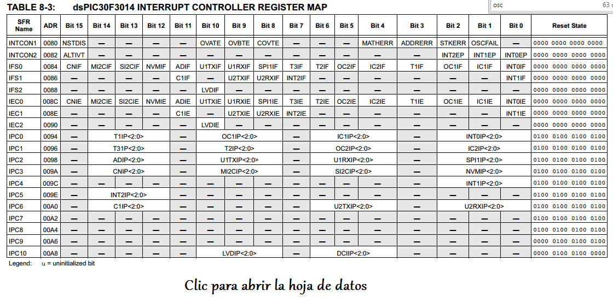

.. -*- coding: utf-8 -*-

.. _rcs_subversion:

Clase 02 - PIII 2015
====================

Ejercicio 4 (clase pasada): Una opción para resolverlo.

.. code-block::

    int contadorRB0 = 0;
    int contadorRB1 = 0;

    void main()  {
        TRISBbits.TRISB0 = 0;
        TRISBbits.TRISB1 = 0;

        LATBbits.LATB0 = 1;
        LATBbits.LATB1 = 1;

        while(1)  {
            contadorRB0++;
            contadorRB1++;

            if (contadorRB0 >= 250)  {
                LATBbits.LATB0 = ~LATBbits.LATB0;
                contadorRB0 = 0;
            }
        
            if (contadorRB1 >= 133)  {
                LATBbits.LATB1 = ~LATBbits.LATB1;
                contadorRB1 = 0;
            }
        
            Delay_ms(1);
        }
    }
	

	
.. figure:: images/clase02/ivt.png
   :target: http://ww1.microchip.com/downloads/en/DeviceDoc/70046E.pdf
   
.. figure:: images/clase02/ivt_dspic33F.png
   :target: http://ww1.microchip.com/downloads/en/DeviceDoc/70214C.pdf
   

- Cuando una interrupción es atendida, el PC (Program Counter) se carga con la dirección que indica la tabla de vector de interrupción (IVT)
   

* Escribir una rutina del servicio de interrupción (ISR)*   
- Función void sin parámetros
- No puede ser invocada

.. code-block::

	void interrupcionExterna()  org 0x0014  {

	}

**Registros para configuración**
	
- IFS0<15:0>, IFS1<15:0>, IFS2<15:0>
	- Banderas de solicitud de interrupción. (el software debe borrarlo - hay que hacerlo sino sigue levantando la interrupción).

- IEC0<15:0>, IEC1<15:0>, IEC2<15:0>
	- Bits de control de habilitación de interrupción.

- IPC0<15:0>... IPC10<7:0>
	- Prioridades

- INTCON1<15:0>, INTCON2<15:0>
	- Control de interrupciones.
		- INTCON1 contiene el control y los indicadores de estado. 
		- INTCON2 controla la señal de petición de interrupción externa y el uso de la tabla AIVT.

Secuencia de interrupción
+++++++++++++++++++++++++

- Las banderas de interrupción se muestrean en el comienzo de cada ciclo de instrucción por los registros IFSx. 
- Una solicitud de interrupción pendiente (IRQ) se indica mediante la bandera en '1' en un registro IFSx. 
- La IRQ provoca una interrupción si se encuentra habilitado con IECx. 
- El IVT contiene las direcciones iniciales de las rutinas de interrupción para cada fuente de interrupción.

**Interrupciones externas INT0 INT1 y INT2**

.. code-block::

    void detectarInt0() org 0x0014  {
								0x0014 - INT0  
								0x0034 - INT1
								0x0042 - INT2
    }

**Para elegir lanzar la interrupción con flanco ascendente o descendente hacemos:**

.. code-block::

	void configuracion()  {
	    INTCON2bits.INT0EP = 0;  // 0 para Ascendente y 1 para Descendente
	    INTCON2bits.INT1EP = 0;
	    INTCON2bits.INT2EP = 0;

	    IFS0bits.INT0IF = 0;  // Borramos la bandera

	    IEC0bits.INT0IE = 1;  // Habilitamos la interrupción
	}
			

**Ejemplo: Cambia de estado un led en PORTD0 cada vez que se detecta un flanco descendente en INT0**

.. code-block::

    void detectarInt0() org 0x0014  {
        IFS0bits.INT0IF = 0;
        LATDbits.LATD0 = ~LATDbits.LATD0;
    }

    void configuracionPuertos()  {
        TRISDbits.TRISD0 = 0;  // Para led Int0
    }

    void main()  {
        configuracionPuertos();

        INTCON2bits.INT0EP = 1;

        IEC0bits.INT0IE = 1;

        while(1)  {
        }
    }

**Ejemplo (para dsPIC30F4013):**
El ejemplo muestra cómo el dsPIC reacciona a un flanco de señal ascendente en el puerto RF6 (INT0). Para cada flanco ascendente el valor en el puerto D se incrementa en 1.

.. code-block::

    void deteccionDeInterrupcion() org 0x0014  {   // Interrupción en INT0
        LATD++;		// Incrementamos el contador
        IFS0.F0 = 0;      // Decimos que ya atendimos la interrupción
    }

    void main(){
        TRISD = 0;      // Contador de eventos por interrupción
        TRISA = 0xFFFF; // PORTA para leer el pin RA11
        IFS0 = 0;       // Interrupción puesta en cero
        IEC0 = 1;       // Interrupción en el flanco ascendente de INT0 (RA11)
        while(1) 
            asm nop;
    }

*La secuencia es la siguiente:*

- Se utiliza el PORTD para mostrar el número de eventos de interrupción.
- PORTF como entrada para producir una interrupción cuando en INT0 (RA11) cambie de cero a 1. 
- En el registro IEC0, el bit menos significativo está en uno para interrumpir con INT0. 
- Cuando se produce una interrupción, la función deteccionDeInterrupcion se invoca
- Por la instrucción org en la tabla de vectores de interrupción se escribe la función en la posición de memoria 0x000014.
- Cuando en RA11 aparece un 1, se escribe un 1 en el bit menos significativo del registro IFS0. A continuación, se verifica si la interrupción INT0 está activado (el bit menos significativo de IEC0). 
- Se lee de la tabla de vectores de interrupción qué parte del programa se debe ejecutar. 
- En la posición 0x000014 está la función deteccionDeInterrupcion , se ejecuta y vuelve al main.
- Dentro de la función, el software debe poner a cero el bit menos significativo de IFS0. Si no, siempre pensará que hay interrupción.
- Luego incrementamos en 1 LATD.

