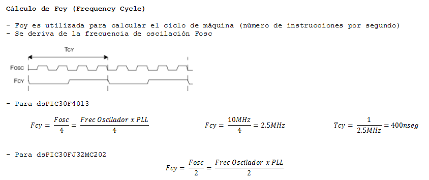

.. -*- coding: utf-8 -*-

.. _rcs_subversion:

Clase 03 - PIII 2015
====================

.. figure:: images/clase03/manejo_osciladores.png

.. figure:: images/clase03/osciladores.png
   :target: http://ww1.microchip.com/downloads/en/DeviceDoc/70046E.pdf

Ejercicio 1
+++++++++++

- Definir las siguientes funciones:

	void retardarUnSegundo();

	void retardo(int segundos);

- Con la siguiente línea consumimos un ciclo de instrucción sin hacer nada
	
	asm nop;

	

