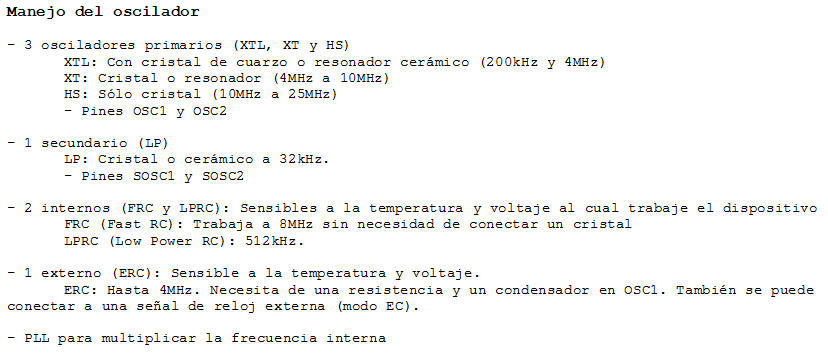

.. -*- coding: utf-8 -*-

.. _rcs_subversion:

Clase 03 - PIII 2015
====================

.. figure:: images/clase03/osciladores.png
   :target: http://ww1.microchip.com/downloads/en/DeviceDoc/70046E.pdf

.. figure:: images/clase03/calculo_fcy.png

Ejercicio 1
+++++++++++

- Definir las siguientes funciones:

	void retardarUnSegundo();

	void retardo(int segundos);

- Con la siguiente línea consumimos un ciclo de instrucción sin hacer nada
	
	asm nop;

*Resolución Ejercicio (clase pasada):* Una opción para resolverlo.

.. code-block::

    int contadorRB0 = 0;
    int contadorRB1 = 0;

    void main()  {
        TRISBbits.TRISB0 = 0;
        TRISBbits.TRISB1 = 0;

        LATBbits.LATB0 = 1;
        LATBbits.LATB1 = 1;

        while(1)  {
            contadorRB0++;
            contadorRB1++;

            if (contadorRB0 >= 250)  {
                LATBbits.LATB0 = ~LATBbits.LATB0;
                contadorRB0 = 0;
            }
        
            if (contadorRB1 >= 133)  {
                LATBbits.LATB1 = ~LATBbits.LATB1;
                contadorRB1 = 0;
            }
        
            Delay_ms(1);
        }
    }
		

