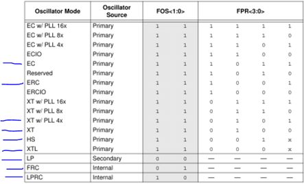
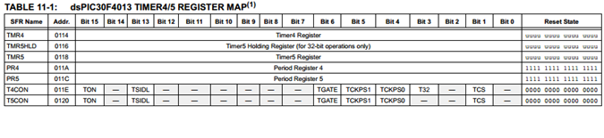
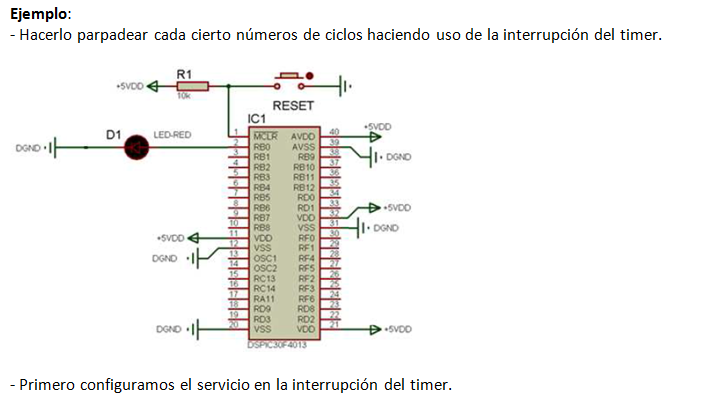

.. -*- coding: utf-8 -*-

.. _rcs_subversion:

Clase 03 - PIII 2016
====================

.. figure:: images/clase03/manejo_osciladores.png

.. figure:: images/clase03/calculo_fcy.png

Ejercicio 1
+++++++++++

- Definir las siguientes funciones:

.. code-block:: c

	void retardarUnSegundo();

	void retardo(int segundos);

- Con la siguiente línea consumimos un ciclo de instrucción sin hacer nada
	
.. code-block:: c
	
	asm nop;

**Resolución Ejercicio (clase pasada):** Esta es una opción para resolverlo sin usar Timers. Pero tener en cuenta que no da exacto. 
Analizar el por qué. Para ver claro que no da exacto, probar con tiempos de 250 us y 133 us.

.. code-block:: c

    int contadorRB0 = 0;
    int contadorRB1 = 0;

    void main()  {
        TRISBbits.TRISB0 = 0;
        TRISBbits.TRISB1 = 0;

        LATBbits.LATB0 = 1;
        LATBbits.LATB1 = 1;

        while(1)  {
            contadorRB0++;
            contadorRB1++;

            if (contadorRB0 >= 250)  {
                LATBbits.LATB0 = ~LATBbits.LATB0;
                contadorRB0 = 0;
            }
        
            if (contadorRB1 >= 133)  {
                LATBbits.LATB1 = ~LATBbits.LATB1;
                contadorRB1 = 0;
            }
        
            Delay_ms(1);
        }
    }
		

.. figure:: images/clase04/manejo_timers.png

.. figure:: images/clase04/map_timer1.png
   :target: http://ww1.microchip.com/downloads/en/devicedoc/70138c.pdf

.. figure:: images/clase04/map_timer23.png
   :target: http://ww1.microchip.com/downloads/en/devicedoc/70138c.pdf

.. code-block::

	void detectarIntT1() org 0x001a  {
	    LATBbits.LATB0 = !LATBbits.LATB0;
	    IFS0bits.T1IF=0;  // Borramos la bandera de interrupción T1
	}

	void main()  {
	    TRISBbits.TRISB0 = 0;
	    LATBbits.LATB0 = 0;

	    // Modo de operación Timer1
	    T1CON=0x0000;

	    // Modo operación Timer1: reloj interno, escala 1:1, empieza cuenta en 0
	    TMR1=0;

	    // Cuenta 500 ciclos
	    PR1=500;

	    // Interrupciones Timer1, borra Bandera de interrupción
	    IFS0bits.T1IF=0;

	    // Habilita interrupción
	    IEC0bits.T1IE=1;

	    // Arranca Timer1
	    T1CONbits.TON=1;

	    while(1)
	       asm nop;
	}

Ejercicio 2
+++++++++++

- Mejorar la solución para el ejercicio de los leds encendiendo a 250 us y 133 us.

