.. -*- coding: utf-8 -*-

.. _rcs_subversion:

Clase 04 - PIII 2015
====================

.. figure:: images/clase04/manejo_timers.png

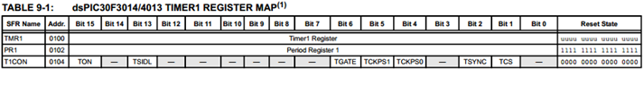

.. figure:: images/clase04/map_timer23.png
   :target: http://ww1.microchip.com/downloads/en/devicedoc/70138c.pdf

.. figure:: images/clase04/map_timer45.png
   :target: http://ww1.microchip.com/downloads/en/devicedoc/70138c.pdf

.. figure:: images/clase04/ejemplo.png

.. code-block::

	void detectarIntT1() org 0x001a  {
	    LATBbits.LATB0 = !LATBbits.LATB0;
	    IFS0bits.T1IF=0;  // Borramos la bandera de interrupción T1
	}

	void main()  {
	    TRISBbits.TRISB0 = 0;
	    LATBbits.LATB0 = 0;

	    // Modo de operación Timer1
	    T1CON=0x0000;

	    // Modo operación Timer1: reloj interno, escala 1:1, empieza cuenta en 0
	    TMR1=0;

	    // Cuenta 500 ciclos
	    PR1=500;

	    // Interrupciones Timer1, borra Bandera de interrupción
	    IFS0bits.T1IF=0;

	    // Habilita interrupción
	    IEC0bits.T1IE=1;

	    // Arranca Timer1
	    T1CONbits.TON=1;

	    while(1)
	       asm nop;
	}

Conversor AD
============	

- Lleva a cabo la digitalización de las señales analógicas externas. 
- En la familia dsPIC30F hay dos versiones: 10 bits y 12 bits.
- Hay dos entradas analógicas para establecer una tensión de referencia externa: AVDD y AVSS (Vref+ y Vref-)
- Para controlar el ADC se usan 6 registros de control de 16 bits: 
	- ADCON1
	- ADCON2
	- ADCON3 sirve para seleccionar el modo del ADC
	- ADCHS para seleccionar las entradas analógicas
	- ADPCFG para seleccionar el pin utilizado como entrada analógica y el pin usado como pin de I/O
	- ADCSSL para seleccionar las entradas analógicas que serán escaneadas

- La conversión se guarda en un buffer de sólo lectura ADBUF0 a ADBUFF (16 palabras de 12 bits)

**Conversor AD de 12 bits**

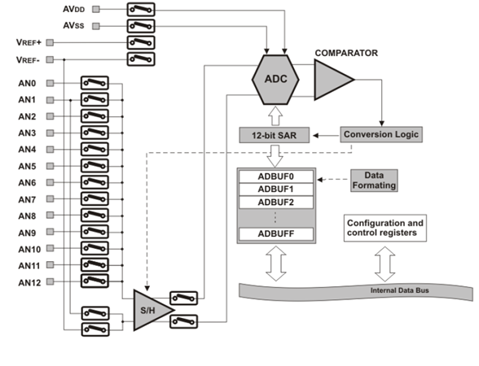

**Una secuencia de conversión**

- El proceso de adquisición de muestras se inicia activando el bit SAMP (este bit está en ADCON1)
- La conversión se puede iniciar por: bits de control programable, contador de tiempo o un evento externo
- Cuando el tiempo de conversión es completa, el resultado se carga en la buffer ADBUF0 a ADBUFF. 
- Al término de la conversión, el bit DONE (está en ADCON1) y la bandera de interrupción se setean luego del número de muestras definidas por los bits de control SMPI (este bit está en ADCON2)

**Pasos para realizar una conversión AD:**

- Configurar el módulo AD
	- Configurar los pines como entradas analógicas, referencias de voltaje, y los pines digitales de I/O
	- Seleccionar un canal de entrada del convertidor AD
	- Seleccionar un reloj de conversión AD
	- Seleccionar una fuente de trigger (disparo)
	- Activar el módulo AD

- Iniciar el muestreo
- Esperar el tiempo de adquisición de muestras
- Fin de adquisición, inicia la conversión
- Esperar que se complete la conversión con el bit DONE
- Leer el buffer
	
ADC controlando los momentos de muestreo con el Timer2	
======================================================

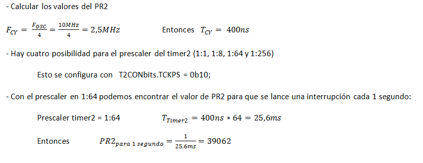

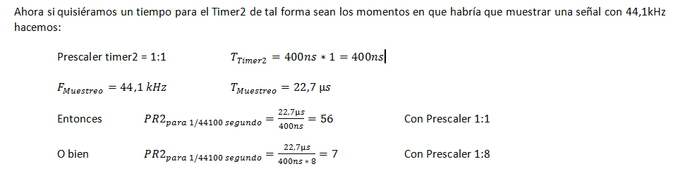

**Código fuente**

.. code-block::

	void initADC()  {
	    ADPCFG = 0xFFFE; // Elije la entrada analógica a convertir en este caso AN0.
	    // Con cero se indica entrada analógica y con 1 sigue siendo entrada digital.

	    ADCON1bits.ADON = 0;  // ADC Apagado por ahora
	    ADCON1bits.ADSIDL = 1;  // No trabaja en modo idle
	    ADCON1bits.FORM = 0b00;  // Formato de salida entero
	    // Para tomar muestras en forma manual. Porque lo vamos a controlar con timer2
	    ADCON1bits.SSRC = 0b000;  
	    // Adquiere muestra cuando el SAMP se pone en 1. SAMP lo controlamos desde el Timer2.
	    ADCON1bits.ASAM = 0;  

	    ADCON2bits.VCFG = 0b000;  // Referencia con AVdd y AVss
	    ADCON2bits.SMPI = 0b0000;  // Lanza interrupción luego de tomar n muestras.
	    // Con SMPI=0b0 -> 1 muestra ; Con SMPI=0b1 -> 2 muestras ; Con SMPI=0b10 -> 3 muestras ; etc.

	    // AD1CON3 no se usa ya que tenemos deshabilitado el cálculo del muestreo con ADCS etc.

	    // Muestreo la entrada analógica AN0 contra el nivel de AVss (AN0 es S/H+ y AVss es S/H-)
	    ADCHS = 0b0000;  

	    ADCON1bits.ADON = 1;// Habilitamos el A/D
	}

	void detectarIntT2() org 0x0020  {
	    IFS0bits.T2IF=0;  // Borramos la bandera de interrupción T2

	    ADCON1bits.DONE = 0;  // Antes de pedir una muestra ponemos en cero
	    ADCON1bits.SAMP = 1;  // Pedimos una muestra

	    asm nop;

	    ADCON1bits.SAMP = 0;  // Pedimos que retenga la muestra
	}

	void interrupcionADC() org 0x002a  {

	    LATCbits.LATC14 = !LATCbits.LATC14;  // Para debug y ver si ingresa acá

	    // Almacenamos los 8 bits más significativos
	    PORTBbits.RB1=ADCBUF0.B2;
	    PORTBbits.RB2=ADCBUF0.B3;
	    PORTBbits.RB3=ADCBUF0.B4;
	    PORTBbits.RB4=ADCBUF0.B5;
	    PORTBbits.RB5=ADCBUF0.B6;
	    PORTEbits.RE0=ADCBUF0.B7;
	    PORTEbits.RE1=ADCBUF0.B8;
	    PORTEbits.RE2=ADCBUF0.B9;

	    IFS0bits.ADIF = 0; // Borramos el flag de interrupciones
	}

	int main()  {

	    // Elegimos el puerto B y E para la salida digital.
	    // Ya que no alcanzan los pines para que todo salga por un único puerto
	    TRISB = 0;
	    TRISE = 0;

	    TRISCbits.TRISC14 = 0;  // Para debug nomás

	    // Configuramos el módulo ADC
	    initADC();

	    IEC0bits.ADIE = 1;  // Habilitamos interrupción del A/D

	    // Modo de operación Timer2 - Con el clock interno
	    T2CON = 0x0000;

	    // Prescaler para timer
	    // 00 -> 1:1 - 01 -> 1:8 - 10 -> 1:64 - 11 -> 1:256
	    T2CONbits.TCKPS = 0b01;

	    TMR2=0;
	    PR2=7;

	    IEC0bits.T2IE=1;  // Habilita interrupciones timer2

	    // Arrancamos el timer2
	    T2CONbits.TON=1;

	    while(1)  {  }

	    return 0;
	}

Registros
=========

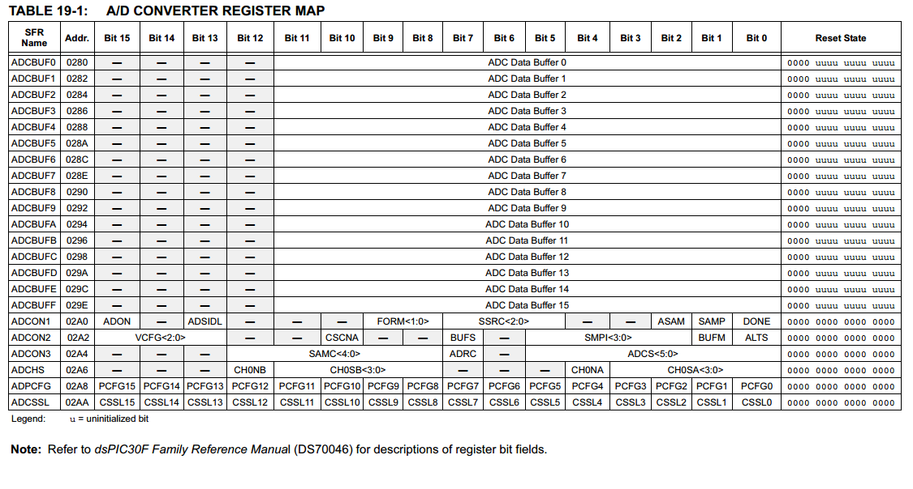

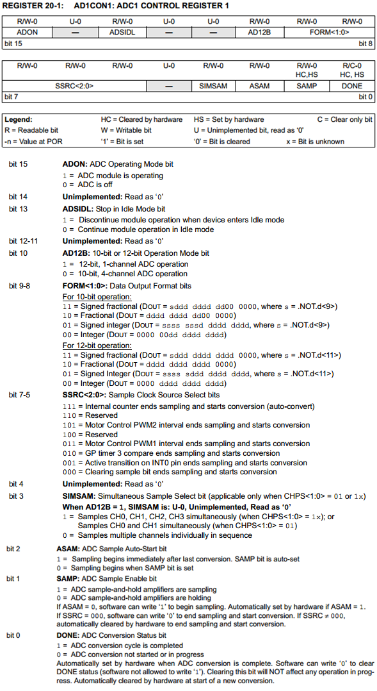
	        
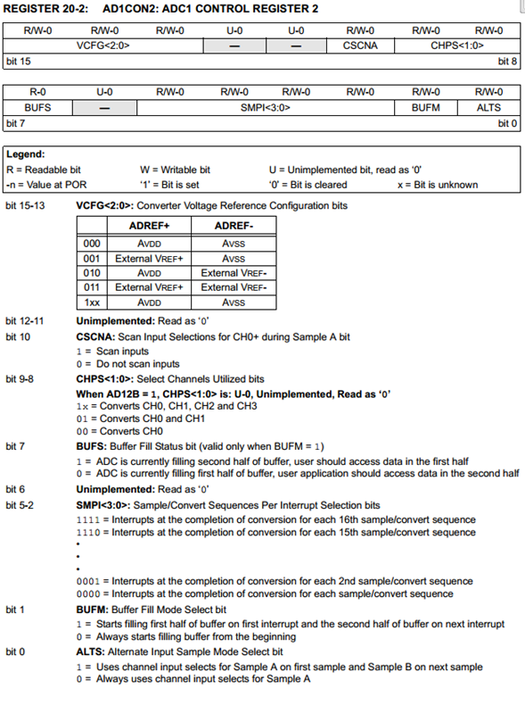
			
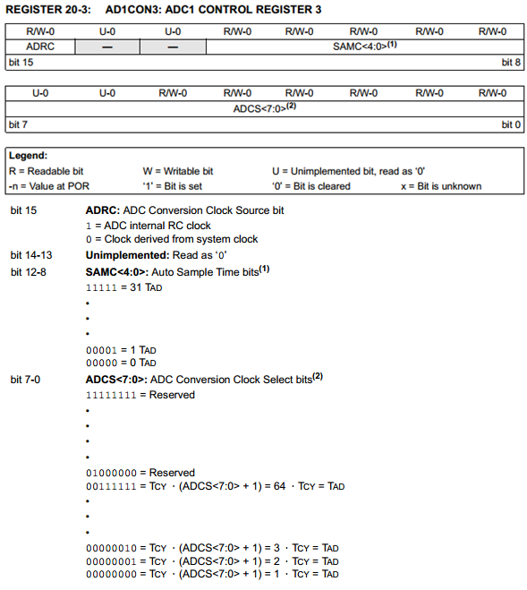
			
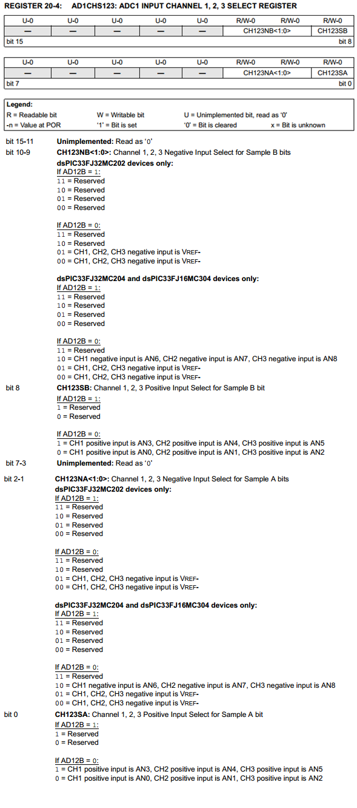

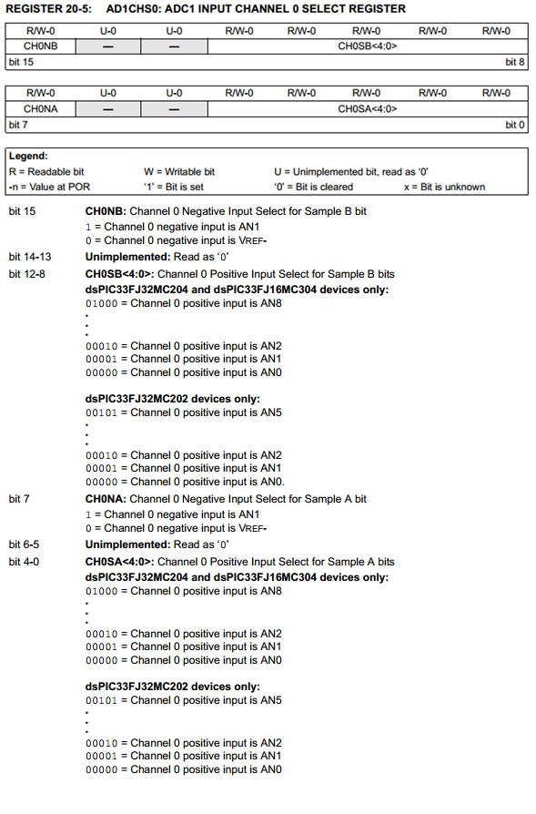

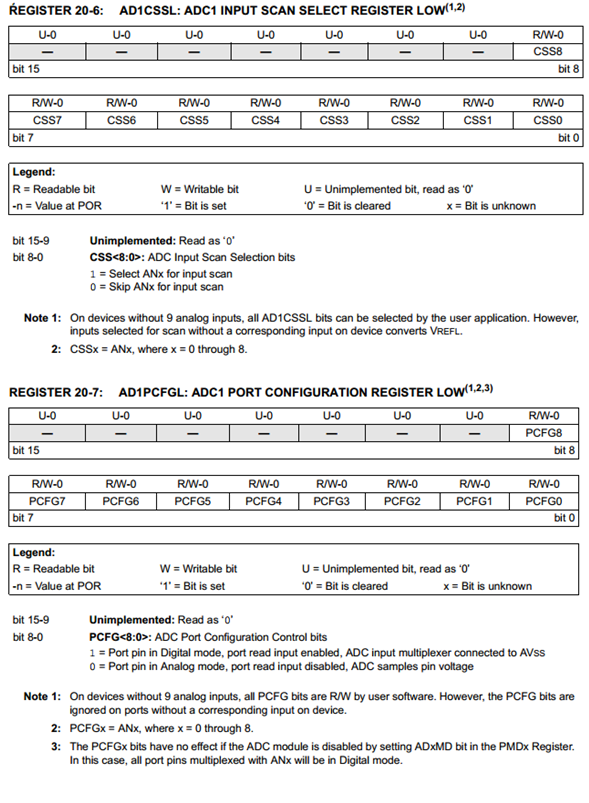

