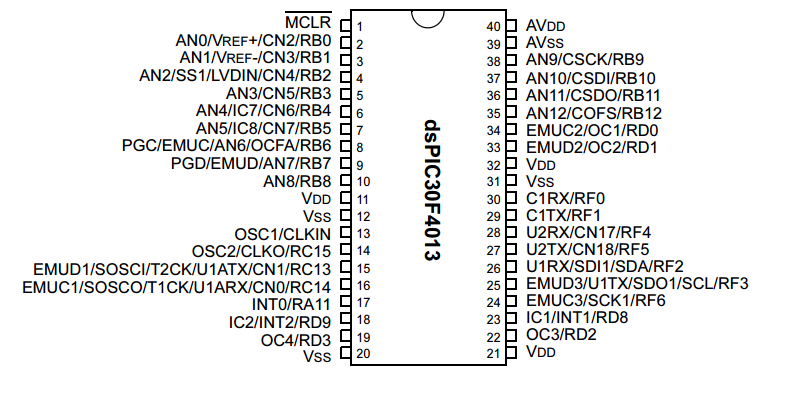
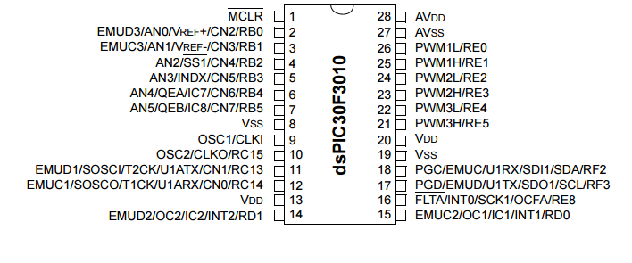

.. -*- coding: utf-8 -*-

.. _rcs_subversion:

Clase 05 - PIII 2015
====================

**Pinout de los dsPIC que utilizaremos**

.. figure:: images/clase05/dspic33fj32mc202.png
   :target: http://ww1.microchip.com/downloads/en/DeviceDoc/70283K.pdf

   

  
**Primer Parcial**
	- Fecha: 16 de septiembre
	- Modalidad (2 opciones): 
		- *Examen en PC:* Se rinde con un trabajo práctico ese mismo 16 de septiembre en los laboratorios de informática. Con Proteus y mikroC.
		- *Entrega de avance de trabajo final:* Hasta el viernes 11 hay tiempo para presentar la propuesta y el 16 lo presentan. 
	- Temas: Interrupciones, Timers, cálculos de tiempos, ADC manual.
	
Ejemplo: ADC controlando los momentos de muestreo con señal cuadrada externa
========

- Para dsPIC33FJ32MC202
- Con flanco descendente de la señal cuadrada en el pin INT0
- Cristal de 10MHz
- ADC de 10 bits
- Entrada analógica en AN0

.. code-block::

	void config_adc()  {
	    ADPCFG = 0xFFFE; // Elije la entrada analogica a convertir en este caso AN0.
	    // Con cero se indica entrada analogica y con 1 sigue siendo entrada digital.

	    AD1CON1bits.ADON = 0;  // ADC apagado por ahora
	    AD1CON1bits.AD12B = 0;  // ADC de 10 bits
	    AD1CON1bits.FORM = 0b00;  // Formato de salida entero

	    // Para tomar muestras en forma manual. Porque lo vamos a controlar con senal externa en INT0
	    AD1CON1bits.SSRC = 0b000;

	    // Adquiere muestra cuando el SAMP se pone en 1. SAMP lo controlamos desde INT0
	    AD1CON1bits.ASAM = 0;

	    AD1CON2bits.VCFG = 0b000;  // Referencia con AVdd y AVss
	    AD1CON2bits.SMPI = 0b0000;  // Lanza interrupción luego de tomar n muestras.
	    // Con SMPI=0b0000 -> 1 muestra ; Con SMPI=0b0001 -> 2 muestras ; Con SMPI=0b0010 -> 3 muestras ; etc.

	    // AD1CON3 no se usa ya que usamos muestreo manual

	    // Muestreo la entrada analogica AN0 contra el nivel de AVss (AN0 es S/H+ y AVss es S/H-)
	    AD1CHS0 = 0b0000;
	}

	void config_int0()  {
	    INTCON2bits.INT0EP = 1;  // 0 para Ascendente y 1 para Descendente
	}

	void config_ports()  {

	    TRISAbits.TRISA0 = 1;  // Entrada analogica para muestrear / AN0

	    // Elegimos los puertos RB0-RB6 y RB8-RB10
	    TRISBbits.TRISB0 = 0;  // Menos significativo
	    TRISBbits.TRISB1 = 0;
	    TRISBbits.TRISB2 = 0;
	    TRISBbits.TRISB3 = 0;
	    TRISBbits.TRISB4 = 0;
	    TRISBbits.TRISB5 = 0;
	    TRISBbits.TRISB6 = 0;
	    TRISBbits.TRISB8 = 0;
	    TRISBbits.TRISB9 = 0;
	    TRISBbits.TRISB10 = 0;  // Mas significativo

	    TRISBbits.TRISB7 = 1;  // Es el pin de la INT0

	    TRISBbits.TRISB11 = 0;  // Para debug ADC
	    TRISBbits.TRISB12 = 0;  // Para debug INT0
	}

	void detect_int0() org 0x0014  {
	    IFS0bits.INT0IF=0;  // Borramos la bandera de interrupción INT0

	    LATBbits.LATB12 = !LATBbits.LATB12;  // Para debug de la interrupcion INT0

	    AD1CON1bits.DONE = 0;  // Antes de pedir una muestra ponemos en cero
	    AD1CON1bits.SAMP = 1;  // Pedimos una muestra

	    asm nop;  // Tiempo que debemos esperar para que tome una muestra

	    AD1CON1bits.SAMP = 0;  // Pedimos que retenga la muestra
	}

	void detect_adc() org 0x002e  {

	    IFS0bits.AD1IF = 0; // Borramos el flag de interrupciones del ADC

	    LATBbits.LATB11 = !LATBbits.LATB11;  // Para debug de la interrupcion ADC

	    // Almacenamos los 8 bits más significativos
	    LATBbits.LATB0 = ADCBUF0.B0;
	    LATBbits.LATB1 = ADCBUF0.B1;
	    LATBbits.LATB2 = ADCBUF0.B2;
	    LATBbits.LATB3 = ADCBUF0.B3;
	    LATBbits.LATB4 = ADCBUF0.B4;
	    LATBbits.LATB5 = ADCBUF0.B5;
	    LATBbits.LATB6 = ADCBUF0.B6;
	    LATBbits.LATB8 = ADCBUF0.B7;
	    LATBbits.LATB9 = ADCBUF0.B8;
	    LATBbits.LATB10 = ADCBUF0.B9;
	}

	int main()  {
	    config_ports();
	    config_int0();
	    config_adc();

	    IEC0bits.INT0IE = 1;  // Habilitamos la interrupcion INT0

	    IEC0bits.AD1IE = 1;  // Habilitamos interrupción del ADC

	    AD1CON1bits.ADON = 1;  // Encendemos el ADC

	    while(1)  {  }

	    return 0;
	}

