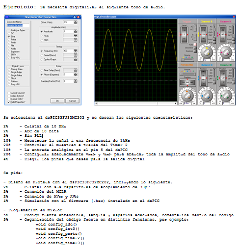
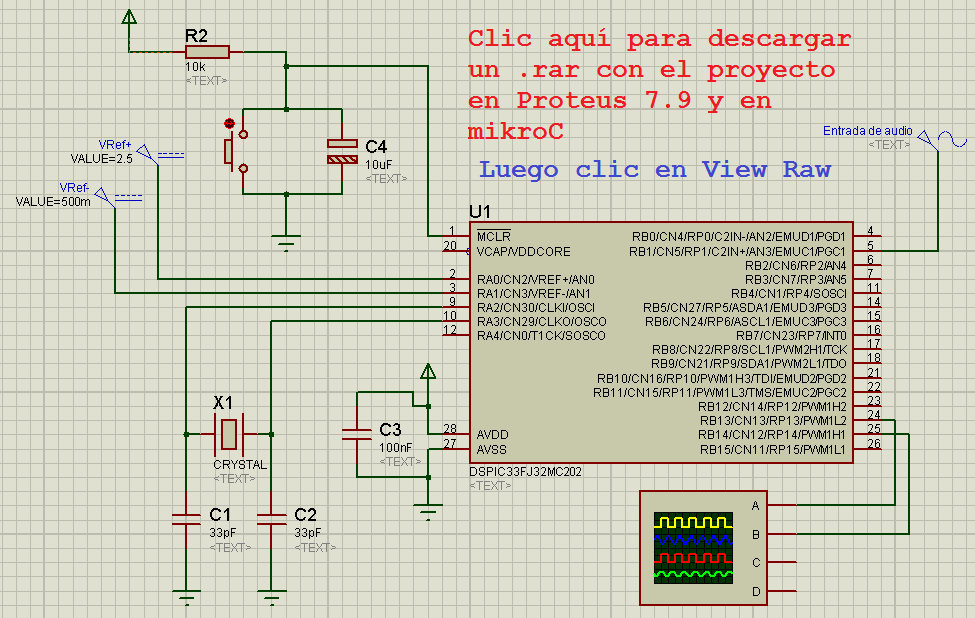
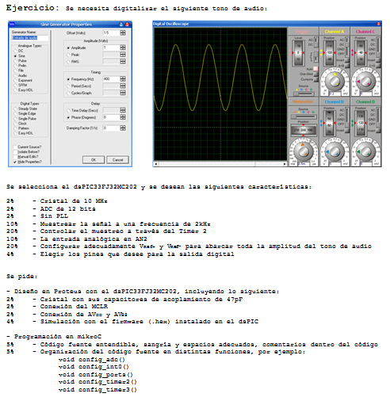
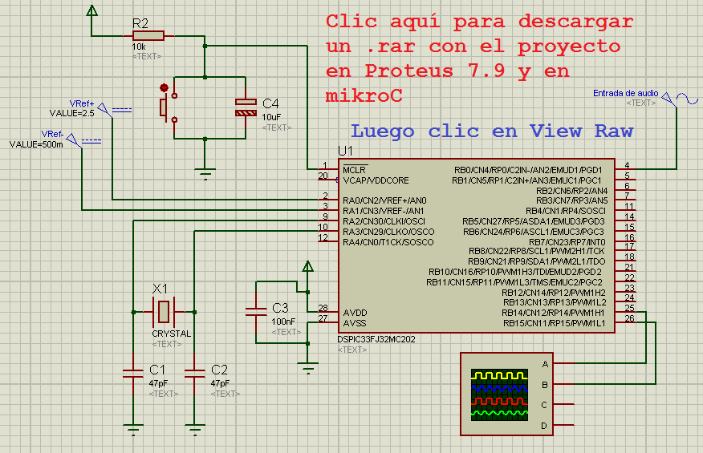
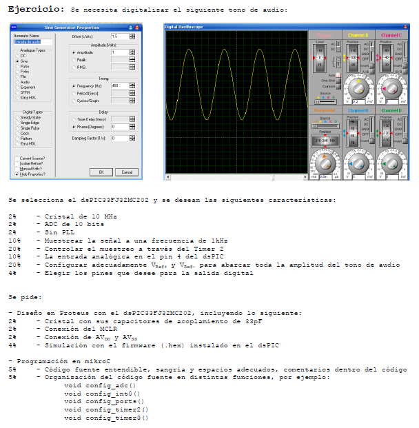

.. -*- coding: utf-8 -*-

.. _rcs_subversion:

Clase 06 - PIII 2015
====================

Primer Parcial - versión 1
^^^^^^^^^^^^^^^^^^^^^^^^^^

   
**Resolución**

   
.. code-block:: c
   
	void config_adc()  {
		ADPCFG = 0xFFF7; // La entrada analogica es el AN3 (pin 5)
		// Con cero se indica entrada analogica y con 1 sigue siendo entrada digital.

		AD1CON1bits.ADON = 0;  // ADC apagado por ahora
		AD1CON1bits.AD12B = 0;  // ADC de 10 bits
		AD1CON1bits.FORM = 0b00;  // Formato de salida entero

		// Tomar muestras en forma manual, porque lo vamos a controlar con el Timer 2
		AD1CON1bits.SSRC = 0b000;

		// Adquiere muestra cuando el SAMP se pone en 1. SAMP lo controlamos desde el Timer 2
		AD1CON1bits.ASAM = 0;

		AD1CON2bits.VCFG = 0b011;  // Referencia con fuente externa VRef+ y VRef-
		AD1CON2bits.SMPI = 0b0000;  // Lanza interrupción luego de tomar n muestras.
		// Con SMPI=0b0000 -> 1 muestra ; Con SMPI=0b0001 -> 2 muestras ; Con SMPI=0b0010 -> 3 muestras ; etc.

		// AD1CON3 no se usa ya que usamos muestreo manual

		// Muestreo la entrada analogica AN3 contra el nivel de VRef+ y VRef-
		AD1CHS0 = 0b00011;
	}

	void config_timer2()  {
		// Prescaler 1:1   -> TCKPS = 0b00 -> Incrementa 1 en un ciclo de instruccion
		// Prescaler 1:8   -> TCKPS = 0b01 -> Incrementa 1 en 8 ciclos de instruccion
		// Prescaler 1:64  -> TCKPS = 0b10 -> Incrementa 1 en 64 ciclos de instruccion
		// Prescaler 1:256 -> TCKPS = 0b11 -> Incrementa 1 en 256 ciclos de instruccion
		T2CONbits.TCKPS = 0b00;

		// Empieza cuenta en 0
		TMR2=0;

		// Cuenta hasta 5000 ciclos y dispara interrupcion
		PR2=5000;  // 5000 * 200 nseg = 1 mseg   ->  1 / 1mseg = 1000Hz
	}

	void config_ports()  {
		TRISAbits.TRISA3 = 1;  // Entrada para muestrear = AN3

		// Elegimos los puertos RB2-RB11 para la salida digital
		TRISBbits.TRISB2 = 0;  // Menos significativo
		TRISBbits.TRISB3 = 0;
		TRISBbits.TRISB4 = 0;
		TRISBbits.TRISB5 = 0;
		TRISBbits.TRISB6 = 0;
		TRISBbits.TRISB7 = 0;
		TRISBbits.TRISB8 = 0;
		TRISBbits.TRISB9 = 0;
		TRISBbits.TRISB10 = 0;
		TRISBbits.TRISB11 = 0;  // Mas significativo

		TRISBbits.TRISB13 = 0;  // Para debug Timer 2
		TRISBbits.TRISB14 = 0;  // Para debug ADC
	}

	void detect_timer2() org 0x0022  {
		IFS0bits.T2IF=0;  // Borramos la bandera de interrupción Timer 2

		LATBbits.LATB13 = !LATBbits.LATB13;  // Para debug de la interrupcion Timer 2

		AD1CON1bits.DONE = 0;  // Antes de pedir una muestra ponemos en cero
		AD1CON1bits.SAMP = 1;  // Pedimos una muestra

		asm nop;  // Tiempo que debemos esperar para que tome una muestra

		AD1CON1bits.SAMP = 0;  // Pedimos que retenga la muestra
	}

	void detect_adc() org 0x002e  {
		IFS0bits.AD1IF = 0; // Borramos el flag de interrupciones del ADC

		LATBbits.LATB14 = !LATBbits.LATB14;  // Para debug de la interrupcion ADC

		// Almacenamos los 10 bits del ADC
		LATBbits.LATB2 = ADCBUF0.B0;
		LATBbits.LATB3 = ADCBUF0.B1;
		LATBbits.LATB4 = ADCBUF0.B2;
		LATBbits.LATB5 = ADCBUF0.B3;
		LATBbits.LATB6 = ADCBUF0.B4;
		LATBbits.LATB7 = ADCBUF0.B5;
		LATBbits.LATB8 = ADCBUF0.B6;
		LATBbits.LATB9 = ADCBUF0.B7;
		LATBbits.LATB10 = ADCBUF0.B8;
		LATBbits.LATB11 = ADCBUF0.B9;
	}

	int main()  {
		config_ports();
		config_timer2();
		config_adc();

		// Habilitamos interrupción del ADC y lo encendemos
		IEC0bits.AD1IE = 1;
		AD1CON1bits.ADON = 1;

		// Habilita interrupción del Timer 2 y lo iniciamos para que comience a contar
		IEC0bits.T2IE=1;
		T2CONbits.TON=1;

		while(1)  {  }

		return 0;
	}

Primer Parcial - versión 2
^^^^^^^^^^^^^^^^^^^^^^^^^^

   
**Resolución**

   
.. code-block:: c

	void config_adc()  {
		ADPCFG = 0xFFFB; // La entrada analogica es el AN2 (pin 4)
		// Con cero se indica entrada analogica y con 1 sigue siendo entrada digital.

		AD1CON1bits.ADON = 0;  // ADC apagado por ahora
		AD1CON1bits.AD12B = 1;  // ADC de 12 bits
		AD1CON1bits.FORM = 0b00;  // Formato de salida entero

		// Tomar muestras en forma manual, porque lo vamos a controlar con el Timer 2
		AD1CON1bits.SSRC = 0b000;

		// Adquiere muestra cuando el SAMP se pone en 1. SAMP lo controlamos desde el Timer 2
		AD1CON1bits.ASAM = 0;

		AD1CON2bits.VCFG = 0b011;  // Referencia con fuente externa VRef+ y VRef-
		AD1CON2bits.SMPI = 0b0000;  // Lanza interrupción luego de tomar n muestras.
		// Con SMPI=0b0000 -> 1 muestra ; Con SMPI=0b0001 -> 2 muestras ; Con SMPI=0b0010 -> 3 muestras ; etc.

		// AD1CON3 no se usa ya que usamos muestreo manual

		// Muestreo la entrada analogica AN2 contra el nivel de VRef+ y VRef-
		AD1CHS0 = 0b00010;
	}

	void config_timer2()  {
		// Prescaler 1:1   -> TCKPS = 0b00 -> Incrementa 1 en un ciclo de instruccion
		// Prescaler 1:8   -> TCKPS = 0b01 -> Incrementa 1 en 8 ciclos de instruccion
		// Prescaler 1:64  -> TCKPS = 0b10 -> Incrementa 1 en 64 ciclos de instruccion
		// Prescaler 1:256 -> TCKPS = 0b11 -> Incrementa 1 en 256 ciclos de instruccion
		T2CONbits.TCKPS = 0b00;

		// Empieza cuenta en 0
		TMR2=0;

		// Cuenta hasta 2500 ciclos y dispara interrupcion
		PR2=2500;  // 2500 * 200 nseg = 500 useg   ->  1 / 500useg = 2000Hz
	}

	void config_ports()  {
		TRISAbits.TRISA2 = 1;  // Entrada para muestrear = AN2

		// Elegimos los puertos RB2-RB11 para la salida digital
		TRISBbits.TRISB2 = 0;  // Menos significativo
		TRISBbits.TRISB3 = 0;
		TRISBbits.TRISB4 = 0;
		TRISBbits.TRISB5 = 0;
		TRISBbits.TRISB6 = 0;
		TRISBbits.TRISB7 = 0;
		TRISBbits.TRISB8 = 0;
		TRISBbits.TRISB9 = 0;
		TRISBbits.TRISB10 = 0;
		TRISBbits.TRISB11 = 0;
		TRISBbits.TRISB12 = 0;
		TRISBbits.TRISB13 = 0;  // Mas significativo

		TRISBbits.TRISB14 = 0;  // Para debug Timer 2
		TRISBbits.TRISB15 = 0;  // Para debug ADC
	}

	void detect_timer2() org 0x0022  {
		IFS0bits.T2IF=0;  // Borramos la bandera de interrupción Timer 2

		LATBbits.LATB14 = !LATBbits.LATB14;  // Para debug de la interrupcion Timer 2

		AD1CON1bits.DONE = 0;  // Antes de pedir una muestra ponemos en cero
		AD1CON1bits.SAMP = 1;  // Pedimos una muestra

		asm nop;  // Tiempo que debemos esperar para que tome una muestra

		AD1CON1bits.SAMP = 0;  // Pedimos que retenga la muestra
	}

	void detect_adc() org 0x002e  {
		IFS0bits.AD1IF = 0; // Borramos el flag de interrupciones del ADC

		LATBbits.LATB15 = !LATBbits.LATB15;  // Para debug de la interrupcion ADC

		// Almacenamos los 10 bits del ADC
		LATBbits.LATB2 = ADCBUF0.B0;
		LATBbits.LATB3 = ADCBUF0.B1;
		LATBbits.LATB4 = ADCBUF0.B2;
		LATBbits.LATB5 = ADCBUF0.B3;
		LATBbits.LATB6 = ADCBUF0.B4;
		LATBbits.LATB7 = ADCBUF0.B5;
		LATBbits.LATB8 = ADCBUF0.B6;
		LATBbits.LATB9 = ADCBUF0.B7;
		LATBbits.LATB10 = ADCBUF0.B8;
		LATBbits.LATB11 = ADCBUF0.B9;
		LATBbits.LATB12 = ADCBUF0.B10;
		LATBbits.LATB13 = ADCBUF0.B11;
	}

	int main()  {
		config_ports();
		config_timer2();
		config_adc();

		// Habilitamos interrupción del ADC y lo encendemos
		IEC0bits.AD1IE = 1;
		AD1CON1bits.ADON = 1;

		// Habilita interrupción del Timer 2 y lo iniciamos para que comience a contar
		IEC0bits.T2IE=1;
		T2CONbits.TON=1;

		while(1)  {  }

		return 0;
	}

Primer Parcial - versión 3 y versión 4
^^^^^^^^^^^^^^^^^^^^^^^^^^^^^^^^^^^^^^

**Las versiones 3 y 4 del parcial son muy similares a la versión 1 y 2**

   

   

