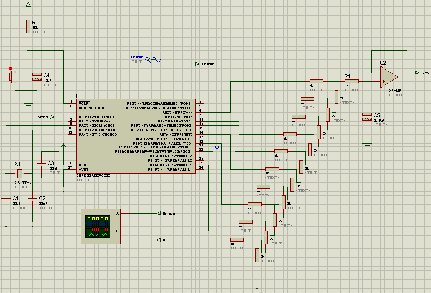
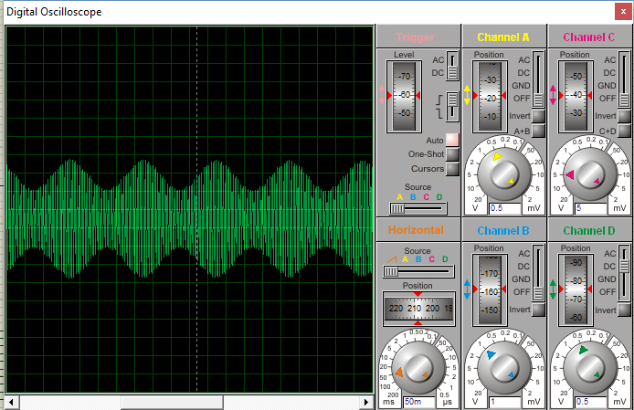

.. -*- coding: utf-8 -*-

.. _rcs_subversion:

Clase 06 - PIII 2016
====================

Guía de ejercicios
==================

Se presentan los enunciados de los prácticos y las variantes para cada alumno.

Práctico 1
==========

Muestrear una señal analógica, aplicarle un trémolo y mostrar la resultante luego de un DAC R-2R.

**Especificaciones comunes:**

- Entrada por AN2
- Utilizar Vref+ y Vref- con valores óptimos
- Frecuencia de señal analógica 150 Hz
- Entíendase el trémolo como una señal modulante con la que se logra un índice de modulación particular
- Frecuencia de muestreo: 600 Hz
- ADC de 10 bits

**Entregable:**

- Proyecto en Proteus
- Proyecto en mikroC
- Captura de pantalla del osciloscopio de Proteus con la señal resultante
- Captura de pantalla con el esquema en Proteus
- En caso de no lograr el resultado esperado, se debe entregar además de lo anterior, un reporte con discusión de los resultados obtenidos

**Variaciones por alumno:**

:Elián:
    Frecuencia del trémolo: 2 Hz
	
    Amplitud pico a pico señal analógica: 0.6 V
	
    Índice de modulación del 20%
	
    Offset señal analógica: 0.8 V

:Gastón:
    Frecuencia del trémolo: 18 Hz
	
    Amplitud pico a pico señal analógica: 2 V
	
    Índice de modulación del 30%
	
    Offset señal analógica: 1.2 V

:Juan:
    Frecuencia del trémolo: 8 Hz
	
    Amplitud pico a pico señal analógica: 800 mV
	
    Índice de modulación del 40%
	
    Offset señal analógica: 1.2 V

:Leandro:
    Frecuencia del trémolo: 23 Hz
	
    Amplitud pico a pico señal analógica: 300 mV
	
    Índice de modulación del 50%
	
    Offset señal analógica: 2.2 V

:Lucas:
    Frecuencia del trémolo: 41 Hz
	
    Amplitud pico a pico señal analógica: 1.3 V
	
    Índice de modulación del 60%
	
    Offset señal analógica: 1.3 V

:Mauricio:
    Frecuencia del trémolo: 29 Hz
	
    Amplitud pico a pico señal analógica: 500 mV
	
    Índice de modulación del 70%
	
    Offset señal analógica: 1 V

:Tomás:
    Frecuencia del trémolo: 35 Hz
	
    Amplitud pico a pico señal analógica: 1 V
	
    Índice de modulación del 80%
	
    Offset señal analógica: 1.5 V
	
**Ejemplo que sirve de guía:** 

- `Solución de un ejercicio parecido <https://github.com/cosimani/Curso-PIII-2016/blob/master/resources/clase06/Ej1.rar?raw=true>`_

Práctico 2
==========

- Muestrear una señal de entrada, la cual está compuesta por dos señales de frecuencias distintas sumadas con un operacional.
- Aplicar un filtro pasa altos para eliminar la señal de frecuencia más baja.
- Colocar dos llaves, una para aplicar o no el filtro, y otra para sumar o no las dos frecuencias (guiarse por el proyecto de ejemplo).

**Especificaciones comunes:**

- Entrada por AN4
- Utilizar Vref+ y Vref- con valores óptimos
- ADC de 10 bits

**Entregable:**

- Proyecto en Proteus
- Proyecto en mikroC
- Captura de pantalla del osciloscopio de Proteus con todas las señales resultantes (conmutando las llaves)
- Captura de pantalla con el esquema en Proteus
- En caso de no lograr el resultado esperado, se debe entregar además de lo anterior, un reporte con discusión de los resultados obtenidos

**Variaciones por alumno:**

:Elián:
    Frecuencia de la señal de menor frecuencia: 10 Hz
    
    Amplitud de esta señal: 1 Vpp
	
    Elegir la frecuencia y amplitud de la otra señal de mayor frecuencia
	
:Gastón:
    Frecuencia de la señal de menor frecuencia: 15 Hz
    
    Amplitud de esta señal: 0.5 Vpp
	
    Elegir la frecuencia y amplitud de la otra señal de mayor frecuencia

:Juan:
    Frecuencia de la señal de menor frecuencia: 7 Hz
    
    Amplitud de esta señal: 0.7 Vpp
	
    Elegir la frecuencia y amplitud de la otra señal de mayor frecuencia

:Leandro:
    Frecuencia de la señal de menor frecuencia: 5 Hz
    
    Amplitud de esta señal: 0.5 Vpp
	
    Elegir la frecuencia y amplitud de la otra señal de mayor frecuencia

:Lucas:
    Frecuencia de la señal de menor frecuencia: 12 Hz
    
    Amplitud de esta señal: 0.3 Vpp
	
    Elegir la frecuencia y amplitud de la otra señal de mayor frecuencia

:Mauricio:
    Frecuencia de la señal de menor frecuencia: 18 Hz
    
    Amplitud de esta señal: 0.6 Vpp
	
    Elegir la frecuencia y amplitud de la otra señal de mayor frecuencia

:Tomás:
    Frecuencia de la señal de menor frecuencia: 8 Hz
    
    Amplitud de esta señal: 0.85 Vpp
	
    Elegir la frecuencia y amplitud de la otra señal de mayor frecuencia
	
**Ejemplo que sirve de guía:** 

- `Solución de un ejercicio parecido <https://github.com/cosimani/Curso-PIII-2016/blob/master/resources/clase06/Ej2.rar?raw=true>`_

Práctico 3
==========

- Elegir uno de los prácticos y llevarlo a la placa.

**Entregable:**

- Proyecto en mikroC
- Videos de todo funcionando, mostrando el osciloscopio y las conexiones con la placa (grabar 2 o 3 videos).
- Un reporte con discusión de los resultados obtenidos