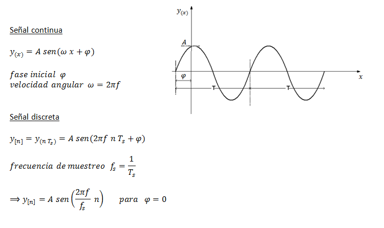
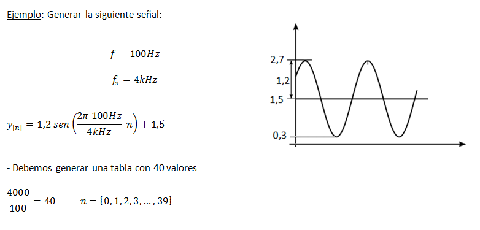
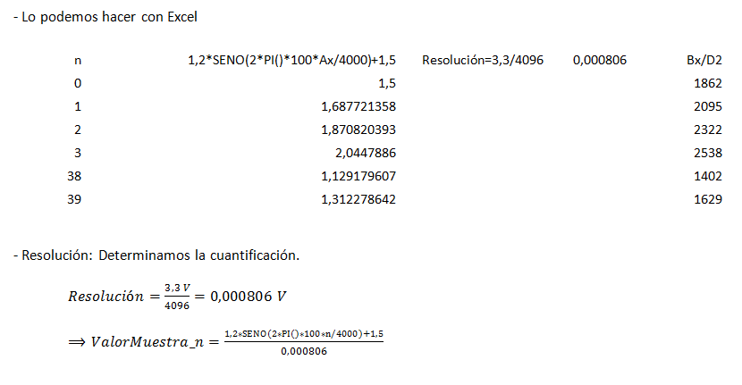
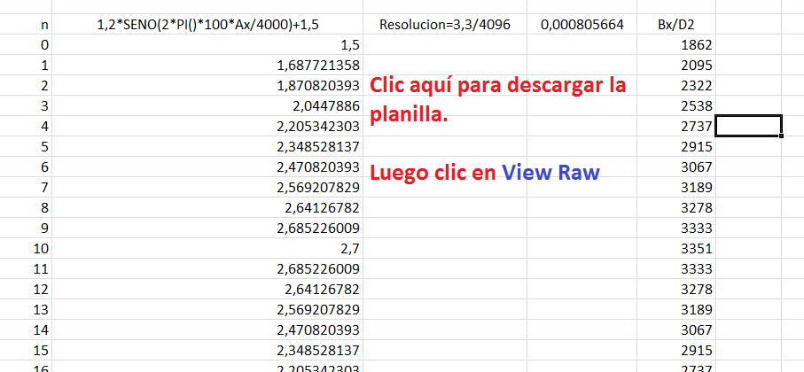
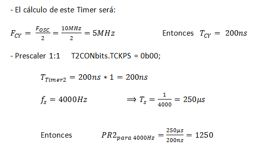
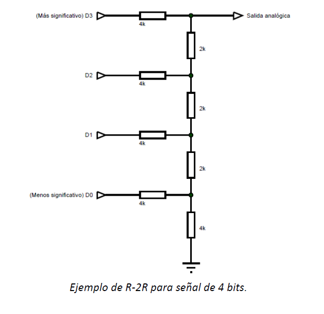
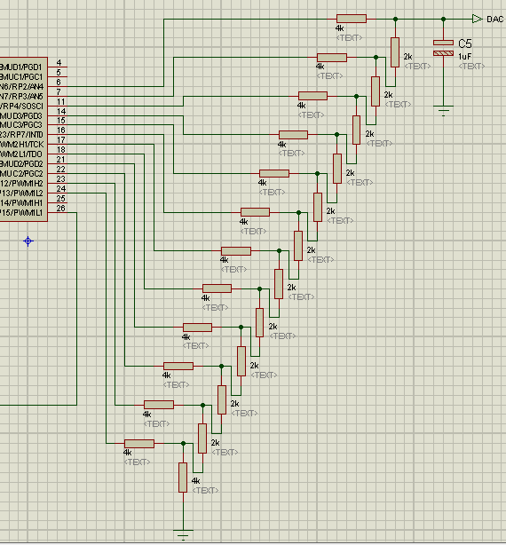
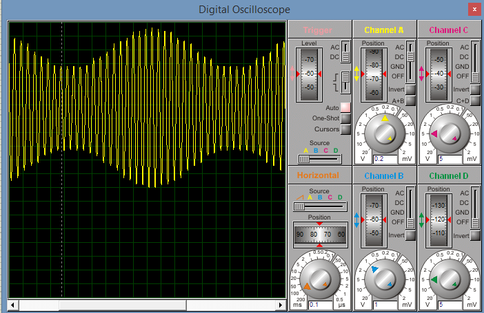

.. -*- coding: utf-8 -*-

.. _rcs_subversion:

Clase 07 - PIII 2015
====================

**Generador de señales**

   

.. code-block:: c

	int pos = 0;
	int valorActual = 0;

	int seno[40] = { 1862,2095,2322,2538,2737,2915,3067,3189,3278,3333,
	                 3351,3333,3278,3189,3067,2915,2737,2538,2322,2095,
	                 1862,1629,1402, 1186,986, 809, 657, 535, 445, 391,
	                 372, 391, 445, 535, 657, 809, 986, 1186,1402,1629 };
			 
	void detectarInt_T2() org 0x0022  {
	    IFS0bits.T2IF = 0;
		 
	    LATBbits.LATB15 = !LATBbits.LATB15;

	    valorActual = seno[pos];

	    LATBbits.LATB2 =  (valorActual & 0b0000100000000000) >> 11;
	    LATBbits.LATB3 =  (valorActual & 0b0000010000000000) >> 10;
	    LATBbits.LATB4 =  (valorActual & 0b0000001000000000) >> 9;
	    LATBbits.LATB5 =  (valorActual & 0b0000000100000000) >> 8;
	    LATBbits.LATB6 =  (valorActual & 0b0000000010000000) >> 7;
	    LATBbits.LATB7 =  (valorActual & 0b0000000001000000) >> 6;
	    LATBbits.LATB8 =  (valorActual & 0b0000000000100000) >> 5;
	    LATBbits.LATB9 =  (valorActual & 0b0000000000010000) >> 4;
	    LATBbits.LATB10 = (valorActual & 0b0000000000001000) >> 3;
	    LATBbits.LATB11 = (valorActual & 0b0000000000000100) >> 2;
	    LATBbits.LATB12 = (valorActual & 0b0000000000000010) >> 1;
	    LATBbits.LATB13 = (valorActual & 0b0000000000000001) >> 0;

	    pos = pos + 1;

	    if (pos >= 40)  {
	        pos = 0;
	    }
	}

	void configuracionPuertos()  {

	    TRISBbits.TRISB2 = 0;  // Bit menos significativo de la senal generada
	    TRISBbits.TRISB3 = 0;
	    TRISBbits.TRISB4 = 0;
	    TRISBbits.TRISB5 = 0;
	    TRISBbits.TRISB6 = 0;
	    TRISBbits.TRISB8 = 0;
	    TRISBbits.TRISB9 = 0;
	    TRISBbits.TRISB10 = 0;
	    TRISBbits.TRISB11 = 0;
	    TRISBbits.TRISB12 = 0;
	    TRISBbits.TRISB13 = 0;  // Bit mas significativo de la senal generada

	    TRISBbits.TRISB15 = 0;  // Debug Timer 2
	}

	void configuracionT2()  {
	    T2CONbits.TCKPS = 0b00;  // prescaler = 1:1
	    PR2 = 1250;  // Genera interrupcion del Timer 2 a 4kHz

	    IEC0bits.T2IE = 1;
	}

	int main()  {
	    configuracionPuertos();
	    configuracionT2();

	    T2CONbits.TON = 1;

	    while(1)  {
	    }

	    return 0;
	}

**¿Cómo visualizamos la señal generada? Con un DAC R-2R**

**Ejercicio 1:**

- Generar una señal de 4Hz pensado para aplicar un efecto trémolo (variación periódica del volumen) a una señal de audio que está siendo muestreada a 4kHz.

**Ejercicio 2:**

- Aplicar el trémolo de 4Hz a la señal generada de 100Hz.

**Ejercicio 3:**

- Muestrear una señal de audio y aplicar el trémolo anterior.

