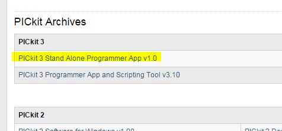
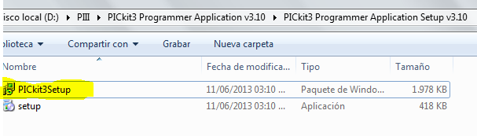
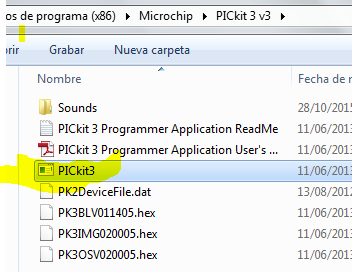
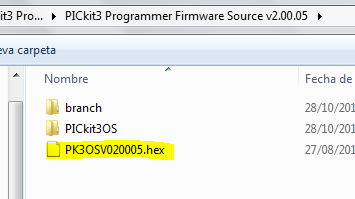
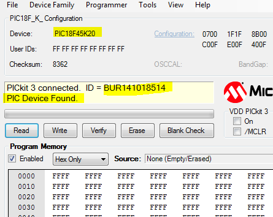
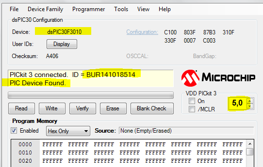
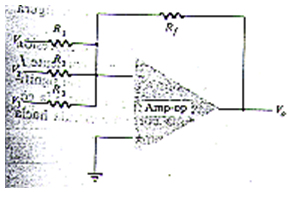

.. -*- coding: utf-8 -*-

.. _rcs_subversion:

Clase 10 - PIII 2015
====================

Grabación de dsPIC con Pickit 3
^^^^^^^^^^^^^^^^^^^^^^^^^^^^^^^

- Descargamos aplicativo desde: http://www.microchip.com/pagehandler/en-us/devtools/dev-tools-parts.html

- Instalamos el aplicativo:

.. figure:: images/clase10/im2.png

- Conectar el Pickit 3 a la PC y esperar que instale controladores (la instalación del aplicativo instala los controladores también).

- Como hubo problemas para hacerlo funcionar. Descargamos también: PICkit 3 Programmer App and Scripting Tool v3.10 ( http://ww1.microchip.com/downloads/en/DeviceDoc/PICkit3%20Programmer%20Application%20v3.10.zip )

- Para abrirlo ejecutamos:

- Este sí funciona, pero requiere instalar un Firmware distinto al PicKit 3. El firmware que se cargó en el PicKit fue:

(Sin embargo ya fue instalado este Firmware en los dos PicKit 3 de la UBP)

- Podemos probar conectando la Demo board que viene con el PicKit 3 ( más info en: http://ww1.microchip.com/downloads/en/DeviceDoc/41296B.pdf )

- Le damos a Check Comunication y nos detecta la Demo Board conectada:

- Si conectamos el circuito de grabación del dsPIC30F3010, también lo detecta:

- Se puede leer el dsPIC y grabar el firmware en un .hex y también se puede escribir nuestro .hex creado con mikroC.

- Abrir mikroC para PIC ( no dsPIC ), crear un proyecto para PIC18F45K20 y grabarlo.

- Video sobre cómo utilizar el generador de señal (https://www.youtube.com/watch?v=qCRcNYbqBxs)

**Ejercicio 1:**

- Hacer un Hola Mundo en mikroC simplemente para hacer parpadear un led. Escribir el programa en mikroC, compilar para generar el hex, grabarlo con el PicKit 3 y por último probarlo en la placa.

Amplificador operacional
^^^^^^^^^^^^^^^^^^^^^^^^

- Entrada diferencial y una ganancia muy alta (generalmente mayor que 100)
- En general se alimenta con fuentes positivas y negativas (permite excursiones tanto por arriba como por debajo tierra)
- Su nombre proviene de una de sus utilidades básicas, como lo son realizar operaciones matemáticas
- Un amplificador operacional ideal tendría ganancia infinita y ninguna corriente de entrada

**Sumador**

- Es probable que el más útil de los circuitos es el circuito amplificador sumador
- Ejemplo: sumador de tres voltajes de entrada, cada uno multiplicado por un factor de ganancia constante

- El voltaje de salida puede expresarse como:

.. code-block:: 

	Vo = (Rf/R1)V1 + (RF/R2)V2 + (Rf/R3)V3

**Ejercicio 2:**

- Utilizar un 741 ( datasheet en: http://www.ti.com/lit/ds/symlink/ua741.pdf )para sumar dos señales (una senoidal y ruido)
- Hacerlo en proteus
- Luego en protoboard con los generadores de señales

**Ejercicio 3:**

- Utilizar un 741 para agregar un offset a una señal de audio
- Hacerlo en Proteus con un archivo WAV
- Luego en protoboard sacando el audio del celular o laptop

