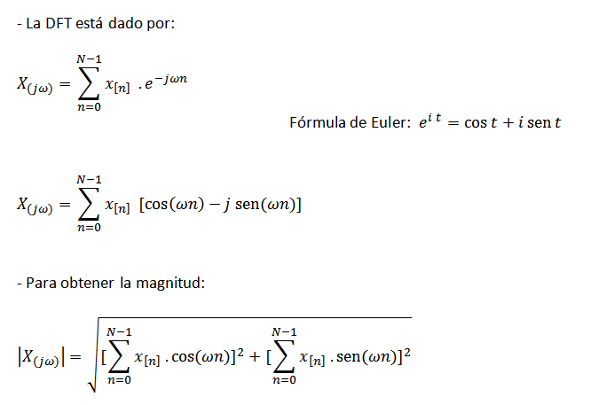
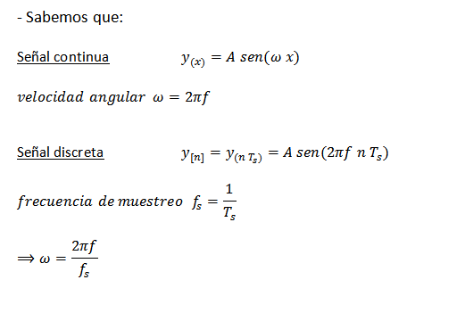
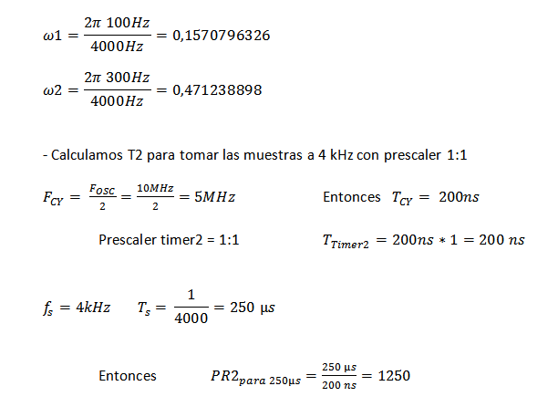

.. -*- coding: utf-8 -*-

.. _rcs_subversion:

Clase 11 - PIII 2015
====================

**Transformada Discreta de Fourier (DFT)**

- Esta última ecuación escrita en C quedaría:

.. code-block:: c

	float dft(float *x_n, float w, unsigned int NN )  {
	    unsigned short n;
	    float R=0.0, I=0.0;

	    // Bucle for para realizar las sumatorias.
	    for( n=0 ; n<NN ; n++ )  {
	        // Cálculo y sumatoria de los componentes
	        // reales e imaginarios.
	        R += x_n[n]*cos( w*n );
	        I += x_n[n]*sin( w*n );
	    }

	    return sqrt(R*R + I*I); 
	}

**Ejemplo 1:** Deseamos averiguar la presencia de frecuencias de 100 Hz y 300 Hz en una señal de audio muestreada a 4kHz.

.. code-block:: c

	void  detectarIntADC()  org 0x002E  {
	    IFS0bits.AD1IF=0;

	    // Se corren las últimas 64 muestras en el bufer x.
	    for( i=63; i!=0; i-- )
	        x[i]=x[i-1];

	    // Se guarda la última muestra.
	    x[0] = ((float)ADC1BUF0);

	    cont = cont + 1;  // Se cuentan las muestras tomadas.

	    if ( cont == 64 )  {  // Se espera a recibir 64 muestras.

	        resultado1 = dft( x, 0.1570796326, 64 );
	        resultado2 = dft( x, 0.47123889803846, 64 );

	        if( resultado1>500 )
	            LATBbits.LATB0=1;
	        else
	            LATBbits.LATB0=0;

	        if( resultado2>500 )
	            LATBbits.LATB1=1;
	        else
	            LATBbits.LATB1=0;

	        cont = 0;
	    }
	}

**Ejemplo 2:** El cálculo del ejemplo anterior se encuentra optimizado dentro de la biblioteca de funciones de MikroC y se utiliza de la siguiente manera:

- Video demostración: https://www.youtube.com/watch?v=n_HLYY41g1E

.. code-block:: c

	// dsPIC30F4013
	// Placa Easy dsPIC 4
	// Entrada analogica AN8 - VRef es AVdd y AVss - 
	// Detecta las frecuencias 100 Hz, 200 Hz, 300 Hz, ..., 6300 Hz
	// Publica el resultado en binario en los puertos RB0-RB5 (valores desde 1 al 63)

	const unsigned long CANT_MUESTRAS = 128;  // 128 pares de valores [Re, Im]
	const unsigned long FREC_MUESTREO  = 12800;  // Frecuencia de muestreo.

	unsigned Samples[CANT_MUESTRAS * 2];  // Capacidad para 256. Porque son 128 pares

	// La funcion FFT requiere que las muestras se almacenen en el bloque de datos Y. 
	// Este bloque de memoria es una caracteristica de los dsPIC que permite realizar 
	// operaciones en una sola instruccion, lo que aumenta la velocidad de calculo.
	ydata unsigned InputSamples[CANT_MUESTRAS * 2];

	unsigned freq = 0;
	
	// Es un indice para llevar la cuenta de cuantas muestras vamos guardando en Samples.
	unsigned globali = 0;  
	
	// Bandera para saber si ya se encuentra listo el procesamiento FFT para mostrar el resultado.
	char listo = 0;  

	void configADC()  {
	    ADPCFG = 0b01111111;  // elegimos AN8 como entrada para muestras
	    ADCHS = 0b1000; // usamos AN8 para recibir las muestras en el ADC
	    ADCON1bits.SSRC = 0b111; //  Internal counter ends sampling and starts conversion (auto convert)
	    ADCON1bits.FORM = 0b11;  // Signed Fractional (DOUT = sddd dddd dd00 0000)
	    ADCON2bits.VCFG = 0b000;  // tension de referencia Avdd y Avss
	    ADCON1bits.ADON = 1;  // Encendemos el ADC
	}

	// Auxiliary function for converting 1.15 radix point to IEEE floating point variable (needed for sqrt).
	float Fract2Float(int input)  {
	    if (input < 0)
	        input = - input;
	    return (input / 32768.);
	}

	// Analiza los componentes de la FFT para luego publicar el resultado en los puertos RB0-RB5
	// Las muestras "Samples" contiene la secuencia Re, Im, Re, Im...
	void obtenerResultado() {
	    unsigned Re, Im, k, max;
	    unsigned i = 0;  // Solo como indice para ir avanzando sobre InputSamples
	    float    ReFloat, ImFloat, amplitud;

		// La k corresponde al componente, k=0 para la continua, k=1 para 100 Hz, 
		// k=2 para 200 Hz, etc. hasta k=63 para 6300 Hz
	    k = 0;  
	    max = 0;  // Almacena el valor maximo de la amplitud de la muestra DFT
	    freq = 0;  // Reset current max. frequency for new reading

	    // 63 ciclos porque no podria muestrear mas de 63 * 100 Hz = 6300 Hz 
		// (que es la mitad de la frecuencia de muestreo)
	    while (k < (CANT_MUESTRAS / 2) )  {
	        Re = InputSamples[i++];  // Parte Real de la muestra DFT
	        Im = InputSamples[i++];  // Parte Imaginaria de la muestra DFT

	        ReFloat = Fract2Float(Re);  // Conversion a float
	        ImFloat = Fract2Float(Im);  // Conversion a float

			// Amplitud de la actual muestra DFT
	        amplitud = sqrt(ReFloat * ReFloat + ImFloat * ImFloat);  
			
			// DFT esta en escala 1/amplitud, por eso lo volvemos a escala
	        amplitud  = amplitud * CANT_MUESTRAS;  

	        if (k == 0)
	            amplitud = 0;  // Elimina la continua

	        if (amplitud > max) {
	            max = amplitud;  // Almacenamos el valor maximo hasta ahora
	            freq = k;  // Almacenamos el componente con mayor potencia
	        }

			// Avanzamos de a un componente. 
			// En este caso, nos desplzamos 100 Hz cada vez que incrementamos k
	        k++;  
	    }

	    // Con esta linea freq tomaria los valores en Hz de la frecuencia con mas potencia.
	    // freq *= (FREC_MUESTREO / CANT_MUESTRAS);

	    // Desplegamos el valor en los puertos RB0-RB5
	    LATBbits.LATB5 = (freq & 0b0000000000100000) >> 5;
	    LATBbits.LATB4 = (freq & 0b0000000000010000) >> 4;
	    LATBbits.LATB3 = (freq & 0b0000000000001000) >> 3;
	    LATBbits.LATB2 = (freq & 0b0000000000000100) >> 2;
	    LATBbits.LATB1 = (freq & 0b0000000000000010) >> 1;
	    LATBbits.LATB0 = (freq & 0b0000000000000001) >> 0;

	    LATBbits.LATB11 = !LATBbits.LATB11;  // Cada vez que se publica el resultado
	}

	unsigned ReadAdc()  {
	    ADCON1bits.SAMP = 1;  // Pedimos una muestra
	    asm nop;  // Tiempo que debemos esperar para que tome una muestra
	    ADCON1bits.SAMP = 0;  // Pedimos que retenga la muestra

	    return ADCBUF0;  // Devolvemos el valor muestreado por el ADC
	}

	// Llena Samples con las muestras en Re y Im se pone en 0. Luego copia en el bloque de memoria Y
	void SampleInput()  {
	    Samples[globali++] = ReadAdc();   // Re
	    Samples[globali++] = 0;           // Im

	    LATFbits.LATF6 = !LATFbits.LATF6;  // En este puerto se puede ver la frecuencia de muestreo

	    // Entra a este if cuando ya tiene 128 pares.
	    if (globali >= (CANT_MUESTRAS * 2) )  {
	        globali = 0;
	        if (!listo)  {  // Todavia no tenemos suficientes muestras
			
			    // Copiamos las muestras del ADC hacia el bloque de memoria Y
	            memcpy(InputSamples, Samples, CANT_MUESTRAS * 2);  
				
				// Ya estamos listos para aplicar FFT. 
				// Esto habilita el uso de la funcion FFT en la funcion main()
	            listo = 1;  
	        }
	    }
	}

	void  config_inicial()  {
	    TRISFbits.TRISF6 = 0;  // Debug frec de muestreo
	    TRISBbits.TRISB11 = 0;  // Debug cada vez que se publica el resultado

	    // Lo siguientes puertos para mostrar la frecuencia con mayor potencia
	    TRISBbits.TRISB0 = 0;
	    TRISBbits.TRISB1 = 0;
	    TRISBbits.TRISB2 = 0;
	    TRISBbits.TRISB3 = 0;
	    TRISBbits.TRISB4 = 0;
	    TRISBbits.TRISB5 = 0;

	    TRISBbits.TRISB8 = 1;  // AN8 para entrada analogica

	    memset(InputSamples, 0, CANT_MUESTRAS * 2);  // Ponemos en cero el buffer para las muestras
	}

	void interrucpcion_timer2() org 0x0020  {
	    SampleInput();  // Se encarga de tomar las muestras
	    IFS0bits.T2IF = 0;  // Bandera Timer 2
	}

	void configuracionT2()  {
	    PR2 = (unsigned long)(Get_Fosc_kHz()) * 1000 / (4 * FREC_MUESTREO);
	    IEC0bits.T2IE = 1;  // Habilitamos interrucion del Timer 2
	}

	void main()  {
	    config_inicial();

	    configuracionT2();
	    T2CONbits.TON = 1;  // Encendemos Timer 2

	    configADC();

	    while (1)  {
	        if (listo) {
	            // Calcula FFT en 7 etapas, 128 pares de muestras almacenados en InputSamples.
	            FFT(7, TwiddleCoeff_128, InputSamples);

	            // Necesario para acomodar en orden natural los bits.
	            BitReverseComplex(7, InputSamples);

	            obtenerResultado();  // Analiza la amplitud de las muestras DFT y publica resultados en RB0-RB5

	            listo = 0;  // Indicamos que publicamos un resultado y ahora esperamos el proximo analisis
	        }
	    }
	}

**Ejercicio 1:** 

- Elejir la frecuencia de una cuerda de la guitarra y adaptar el programa para hacer un afinador de esa cuerda.

**Ejercicio 2:** 

- Que la salida en los puertos RB muestre directamente la frecuencia y no la componente k.

