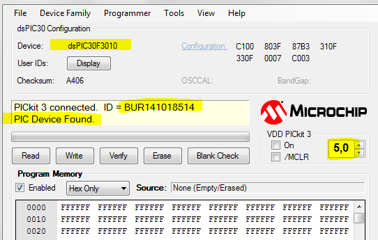

.. -*- coding: utf-8 -*-

.. _rcs_subversion:

Clase 11 - PIII 2016
====================

Grabación de dsPIC con Pickit 3
^^^^^^^^^^^^^^^^^^^^^^^^^^^^^^^

- El Pickit 3 permite programar el dsPIC grabando el archivo .hex compilado con el mikroC
- Requiere el aplicativo programador. `Descargar desde aquí <https://github.com/cosimani/Curso-PIII-2016/blob/master/resources/clase11/PICkit3Setup.rar?raw=true>`_

.. figure:: images/clase11/pickit3_1.png

- Conectar el Pickit 3 a la PC y esperar que instale controladores (la instalación del aplicativo instala los controladores también).

- Para abrirlo ejecutamos:

.. figure:: images/clase10/im4.png

- Podemos probar conectando la Demo board que viene con el PicKit 3 ( más info en: http://ww1.microchip.com/downloads/en/DeviceDoc/41296B.pdf )

- Le damos a Check Comunication y nos detecta la Demo Board conectada:

.. figure:: images/clase10/im6.png

- Si conectamos el circuito de grabación del dsPIC30F3010, también lo detecta:

- Se puede leer el dsPIC y grabar el firmware en un .hex y también se puede escribir nuestro .hex creado con mikroC.

- Se conecta de la siguiente manera:

.. figure:: images/clase11/pickit3_2.png

**Ejercicio 1:**

- Hacer un Hola Mundo en mikroC simplemente para hacer parpadear un led. Escribir el programa en mikroC, compilar para generar el hex, grabarlo con el PicKit 3 y por último probarlo en la placa.

